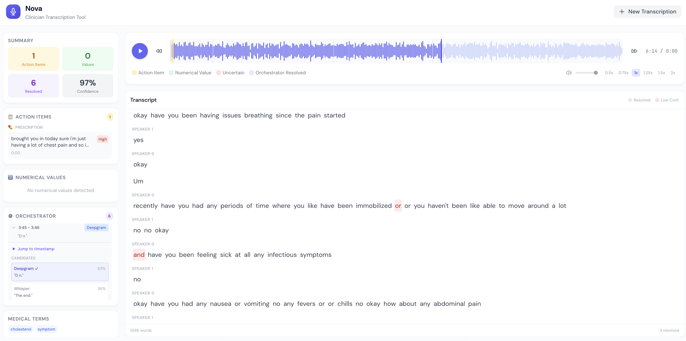

# Nova

A medical transcription app that actually gets the hard parts right.

When doctors record patient visits the audio quality isnt always perfect. Words get mumbled and background noise happens. Most transcription tools just guess and move on. Nova does something different.



## What it does

Nova uses three different AI transcription services at once. When one of them isnt confident about what was said it asks all three to try that part again. Then it uses GPT4 to pick the best answer based on context.

It also pulls out the important stuff automatically. Things like prescriptions, follow up appointments, vitals, and lab values get highlighted so nothing gets missed.

## The tech

Backend is Python with FastAPI. Frontend is React and TypeScript with Tailwind. Audio visualization uses WaveSurfer.js.

## Running it

You need API keys from Deepgram, AssemblyAI, and OpenAI.

Create a `.env` file in the backend folder

```
DEEPGRAM_API_KEY=your_key_here
ASSEMBLYAI_API_KEY=your_key_here
OPENAI_API_KEY=your_key_here
```

Then start the backend

```
cd backend
python -m venv venv
source venv/bin/activate
pip install -r requirements.txt
python main.py
```

And the frontend in another terminal

```
cd frontend
npm install
npm run dev
```

Open localhost:5173 and upload an audio file.
